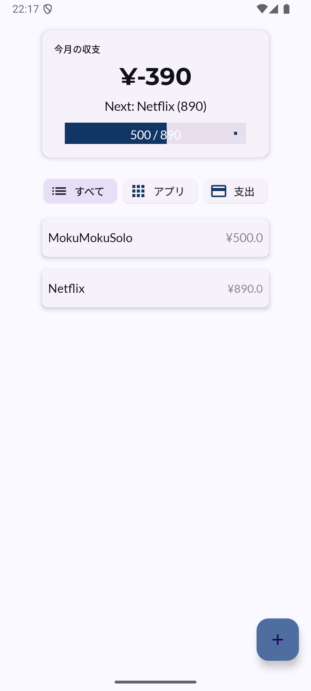
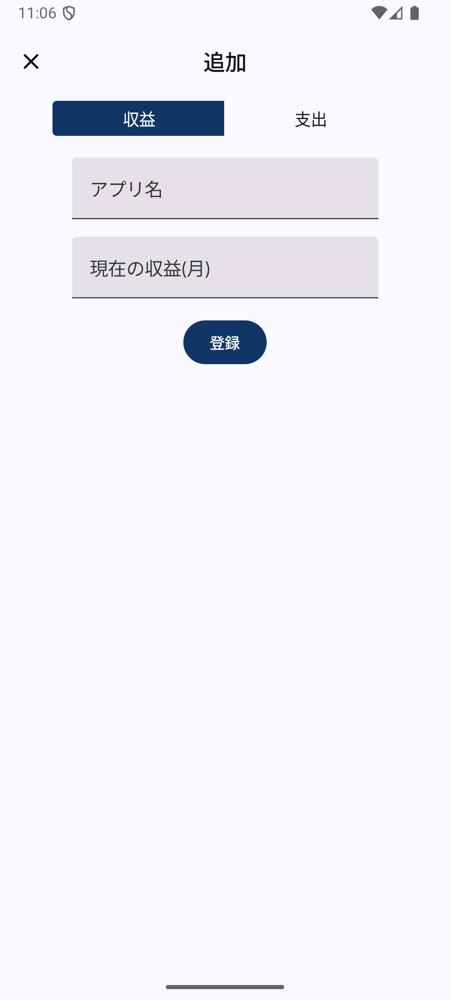
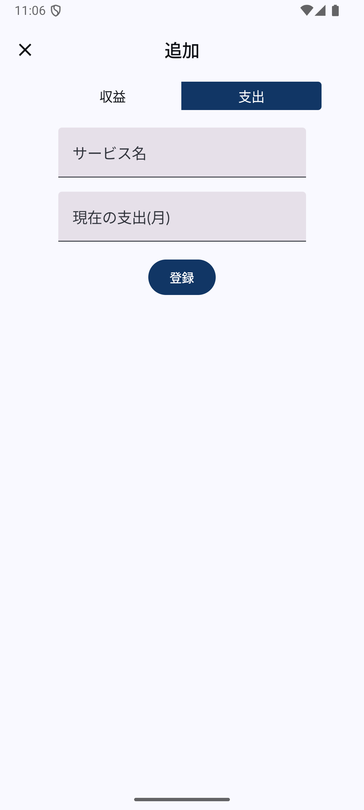

# Afrel(アフレル)-リリース後の継続開発アプリ

| ホーム画面                                                   | 追加画面(収益)                                                   | 追加画面(支出)                                                   |
|---------------------------------------------------------|------------------------------------------------------------|------------------------------------------------------------|
|  |  |  |

## 🎨 開発背景
アプリで収益を得ることを目的に個人開発に挑戦している人であれば、一度は目標に掲げるであろう月1万・5万・10万円ぐらい稼ぎたいなというリアルな数字。 しかし、その数字に現実味が無く、やがてモチベーションを無くしてしまい、開発を辞めてしまうという勿体無い体験をする人を減らしたい！！ そんな思いで開発することを決意しました。

## ✨ 機能
- 収益・支出の登録：日々の収益と支出を登録できます。
- 収益・支出の一覧表示：登録した収益と支出を一覧で確認できます。
- 最も達成しやすい目標金額の確認：収益に基づいて、最も達成しやすい目標をプログレスバーで表示します。

## 🎯 使用技術
| 技術・ライブラリ              | 概要・用途                                                   | 採用理由　                                                              |
|-----------------------|---------------------------------------------------------|--------------------------------------------------------------------|
| Kotlin Multiplatform  | ネイティブ開発の利点を維持しながら、複数のプラットフォームでビジネスロジックやデータ層を共有できる       | iOS/Androidで動作するアプリをリリースしたいかつAndroid開発でKotlinを利用しており開発効率が低下しないと考えたため。 |
| Compose Multiplatform | 複数のプラットフォームで共通のUIを構築することができる宣言的UIフレームワーク                | iOS/Android間でUIを共通化することで少ないコードで品質の高いアプリを作りたかったため。                  |
| Navigation            | アプリ内の画面間を移動するためのライブラリ                                   | アプリに複数のスクリーンを表示する必要があり、画面遷移をシンプルに管理したいと考えたため。                      |
| ViewModel             | UI要素(コンポーザブル)のライフサイクルを超えて、ビジネスロジックまたは画面レベルの状態を保持するライブラリ | UI要素(コンポーザブル)と状態を分離することで単方向データフロー(UDF)を実現し、テストのしやすさなどを考慮するべきだと考えたため。 |
| Room                  | SQlite上に抽象化レイヤを提供する永続化ライブラリ                             | アプリで構造化されたデータを安全に保存するため。                                           |
| Koin                  | 依存性注入(DI)ライブラリ                                          | KMP化でデータベースの初期化やリポジトリなどの依存関係をシンプルに定義し、コンポーネントの疎結合を実現するため。          |